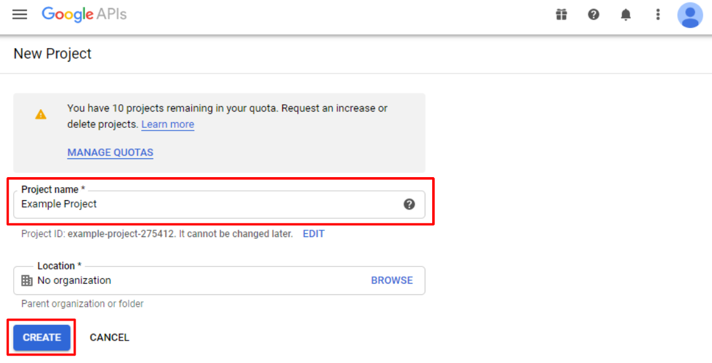
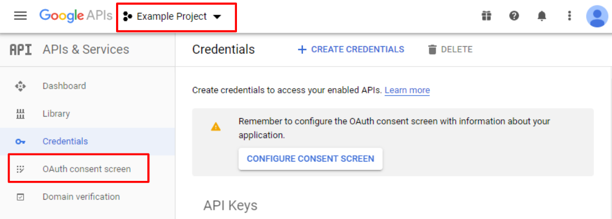
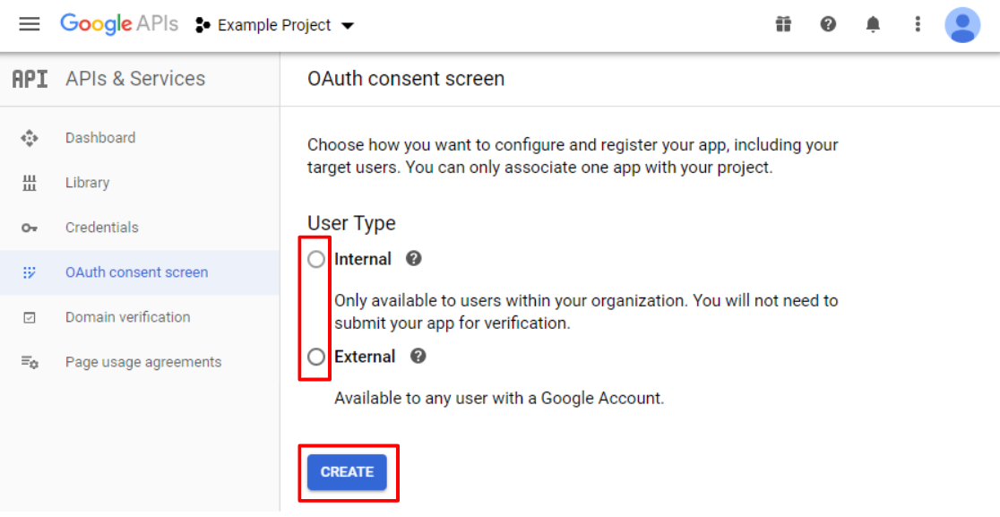
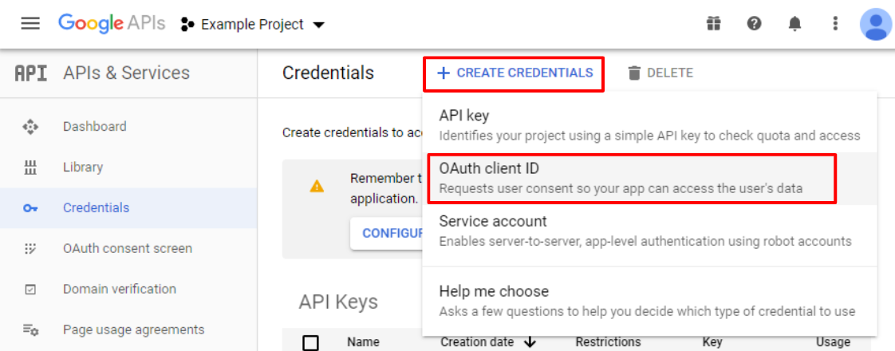
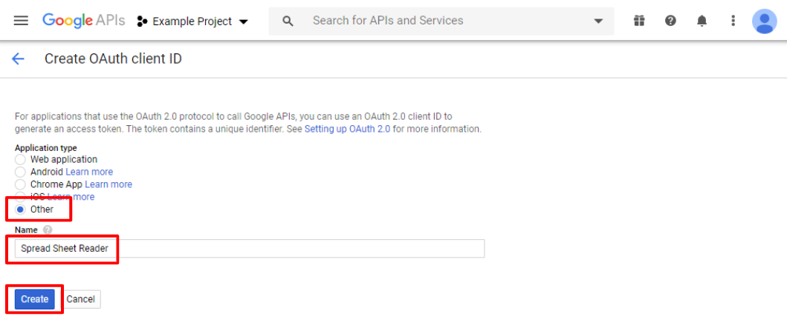

# Usage

## Install

#### Unity2019.3.4 or later
Add the dependency to your manifest.json as follows.

```yaml
{
  "dependencies": {
    "com.harumak.googlesheetfetcher": "https://github.com/Haruma-K/GoogleSheetFetcher.git?path=/Packages/com.harumak.googlesheetfetcher"
  }
}
```

#### Unity2019.3.3 or earlier
1. Download ZIP
2. Copy `Packages/com.harumak.googlesheetfetcher` to your project.
3. Add the dependency to your manifest.json as follows.

```yaml
{
  "dependencies": {
    "com.harumak.googlesheetfetcher": "file:com.harumak.googlesheetfetcher"
  }
}

```

## Create Google Client ID & Client Secret

#### Create the project
Go to [Google Developer Console](https://console.developers.google.com/apis).

If you don't have project, select `Select a project > NEW PROJECT` to create a project.
On the next page, enter the project name and click on the `CREATE` button.

||
|:-:|

#### Create OAuth consent screen
Then select the project, and press `OAuth consent screen` from the menu on the left.

||
|:-:|

Next, select the `User Type` according to the use, and click on the `CREATE`

||
|:-:|

And enter the `Application Name` and press the `SAVE` button on the next page.

#### Create Client ID & Client Secret
Next, click on the `Credentials` from the menu on the left.
And select `CREATE CREDENTIALS > OAuth Client ID`.

||
|:-:|

Select `Other` for the application type, enter an `Name` and click on the `Create` button.

||
|:-:|

## Write a script

#### Initialize
First, instantiate and initialize the Fetcher.

```cs
// Google OAuth2 authorization.
var fetcher = new Fetcher();
await fetcher.InitializeAsync(_clientId, _clientSecret, _applicationId);
```

Then, the OAuth2 authentication page by Google will be opened.
When the user completes the authorization, the authorization information is saved.

#### Fetch values of a sheet
After the authorization, you can fetch the data from Spreadsheet.

```cs
// Get all the values in the sheet.
var values = await fetcher.FetchValuesAsync(_spreadsheetId, sheets[0]);
```

For other APIs, refer to the [API documentation of the Fetcher class](../api/GoogleSheetFetcher.Editor.Fetcher.html).
